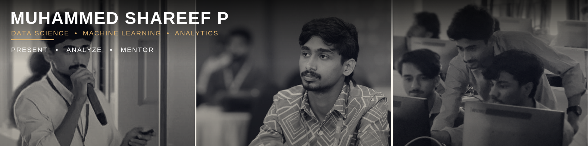

<h1 align="center">👋 Hi, I'm Muhammed Shareef P</h1>

  <strong>Data Scientist · Machine Learning & NLP · Python, SQL, RAG Systems · IEEE Conference Presenter</strong> 
  📍 Malappuram, Kerala, India

---

## 🛠️ Tech Stack

  
  
  
  
  
  
  
  
  
  
  
  
  

---

## 🚀 Projects

### ContextForge — AI Context Layer Generator
> Generate a shared AI knowledge base for your project — one source of truth, every AI coding tool covered.

A CLI tool built with clean architecture principles and packaged for real-world distribution via npm. ContextForge scaffolds a consistent knowledge base across AI coding assistants (Cursor, Copilot, Claude, Codeium, Amazon Q, and more) from a single source — eliminating fragmented, per-tool config drift.

---

### DrugGPT — Multimodal & Multi-Intent-Aware RAG Framework for Drug Information Systems
> A Retrieval-Augmented Generation framework designed to handle complex, multi-intent queries over pharmaceutical knowledge bases using multimodal inputs.

📄 **Presented at:** IEEE SB CCET's *Student Paper Contest 2026*, in association with **IEEE Kochi Subsection** and **IEEE PES Kerala Chapter**.

> 🔒 Repository will be made public post-publication.

---

## 🎓 Education

<!-- TODO: Fill in your degree, college name, and years -->
**[Your Degree]** — [Your College Name] ([Start Year]–[End Year])

---

## 🤝 Let's Connect

  <!-- TODO: Replace YOUR_USERNAME with your actual LinkedIn handle -->
  
  &nbsp;
  

---

  💼 Open to data science opportunities and research collaborations — feel free to reach out.

